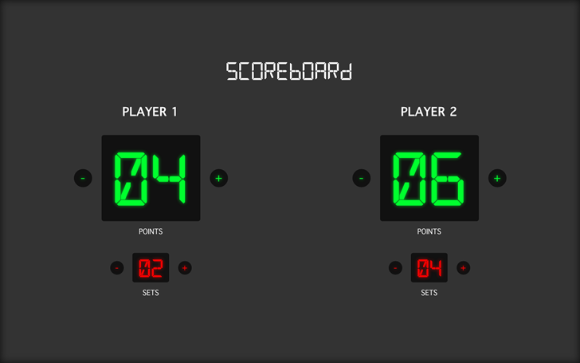

Scoreboard
----------

> A veeery simple scoreboard to count the points of ping pong in our office

[](http://badge.fury.io/js/gulp)

---





Get started
-----------

First of all, you need have installed [Node.js](http://nodejs.org/) and [Gulp](http://gulpjs.com) globally.
Then you can:

- Clone the repo: `git clone git@github.com:acauamontiel/scoreboard.git`
- Enter the folder: `cd scoreboard`
- Install Node dependencies: `npm install`
- Finally install Bower components: `bower install`


Running
-------

You can run the app locally by [Gulp](http://gulpjs.com)

### Available Gulp commands

#### Default - `gulp`

Run `gulp` to compile and watch Jade, Stylus, JavaScript and optimize images running on [localhost:3002](http://localhost:3002)


#### Build - `gulp build`

Run `gulp build` to only compile Jade, Stylus, JavaScript and optimize images  files


#### Dist - `gulp dist`

Run `gulp build` to compile and minify Jade, Stylus, JavaScript and optimize images


Structure
---------

When you have all installed, the structure will look something like this:

```
node_modules/
src/
├── dependencies/
├── css/
│   ├── components/
│   │   └── *.styl
│   ├── core/
│   │   └── *.styl
│   ├── equalizr.styl
│   └── style.styl
├── fonts/
│   └── *.{eot|svg|ttf|woff}
├── html/
│   ├── incs/
│   │   └── *.jade
│   ├── layouts/
│   │   └── *.jade
│   └── index.jade
├── img/
│   └── *.{jpg|png|svg}
├── js/
│   └── app.js
├── .htaccess
├── browserconfig.xml
├── favicon.ico
└── humans.txt
.bowerrc
.editorconfig
.gitattributes
.gitignore
.jshintrc
bower.json
gulpfile.js
package.json
README.md
```


License
-------

© 2014 Acauã Montiel

[MIT License](http://acaua.mit-license.org/)
